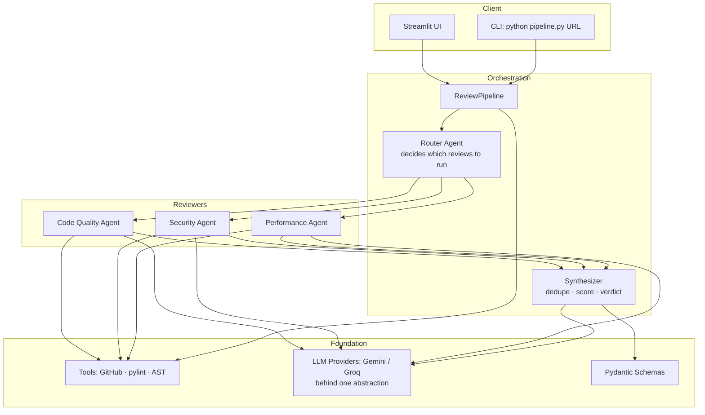

# 🔍 AI Code Review Agent

> Autonomous AI agent that reviews GitHub PRs using multi-step reasoning, tool-augmented analysis, and structured output generation.

Paste a GitHub pull-request URL and the agent fetches the diff, decides *which*
kinds of review the change actually needs, runs specialized reviewers that
combine **real static-analysis tools** (pylint, Python `ast`) with **LLM
reasoning**, then synthesizes everything into a validated, scored report with
inline fix suggestions — in well under a minute.

Built on free APIs only (Google Gemini + GitHub), with Groq/Llama 3 as an
optional backup provider (a one-line swap). **Total running cost: ₹0.**

---

## ✨ What makes this different

This is **not** "paste your code into ChatGPT". It is an *agent*: it makes
decisions, runs tools, and produces structured, validated output.

| | Pasting into ChatGPT | **AI Code Review Agent** |
|---|---|---|
| Decides what to review | ❌ You do | ✅ A **router agent** picks reviewers per PR |
| Uses real tools | ❌ Guesses | ✅ Runs **pylint + AST** and feeds verified facts to the LLM |
| Output | 📝 Free-form prose | ✅ **Pydantic-validated JSON** (severity, line, fix diff) |
| Reliability | ❌ Hope it's JSON | ✅ **Self-correction loop** retries on bad JSON |
| Model lock-in | 🔒 One vendor | ✅ **Provider abstraction** — swap LLM in one line |
| Fails how | 💥 Just errors | ✅ **Graceful degradation** — rule-based fallbacks everywhere |

---

## 🚀 Key features

- **Agentic routing** — a Router Agent reads the PR and autonomously enables only
  the reviewers it needs (a config-only change skips everything; an `auth/` file
  *always* triggers the security reviewer).
- **Tool-augmented review** — pylint and a Python-`ast` analyzer run on the code;
  their verified findings are merged with the LLM's judgment.
- **Three specialized reviewers** — code quality, security (OWASP-style), and
  performance — each with its own domain prompt and rule-based pre-checks.
- **Structured, validated output** — every finding is a typed Pydantic object:
  file, line, severity, category, confidence, and an optional unified-diff fix.
- **Self-correcting LLM layer** — malformed JSON is re-requested with the exact
  error injected into the prompt, up to N retries.
- **Provider abstraction** — Gemini by default, Groq/Llama 3 as an optional
  backup, behind one interface; switch with a one-line config change (or the
  sidebar dropdown), and add a new model by writing one class.
- **Graceful degradation** — if the LLM is down, the synthesizer scores the PR
  heuristically and still returns a valid review. The system *always* answers.
- **Two front ends** — a polished Streamlit web app and a one-line CLI.

---

## 🏗️ Architecture

Four layers, with the agentic logic concentrated in the orchestration layer.



**Flow:** `fetch PR → understand intent → route → run chosen reviewers → synthesize → validated ReviewOutput`.

---

## ⚡ Quick start

### 1. Prerequisites
- Python 3.10+
- A **GitHub token** (`public_repo` scope) and a **Gemini API key** (both free).
  Optional: a **Groq key** for the backup provider.

### 2. Install
```bash
git clone <your-repo-url>
cd ai-code-reviewer
python -m venv venv
source venv/bin/activate          # Windows: venv\Scripts\activate
pip install -r requirements.txt
```

### 3. Configure
```bash
cp .env.example .env              # Windows: copy .env.example .env
# then edit .env and paste in your keys
```
```env
GITHUB_TOKEN=ghp_...
GEMINI_API_KEY=...
GROQ_API_KEY=...                  # optional backup
```

### 4. Run
```bash
# Web app
streamlit run app.py

# …or the CLI
python pipeline.py https://github.com/pallets/click/pull/3526
```

### 5. Test
```bash
# Fast, offline suite (no keys, no network) — runs each file directly:
python tests/test_agents.py
python tests/test_integration.py

# Opt-in LIVE integration tests (hit real GitHub + LLM):
RUN_INTEGRATION_TESTS=1 python tests/test_integration.py
```

---

## 🎬 Demo

> _Screenshots / GIF go here once recorded — see [`demo/demo_script.md`](demo/demo_script.md)._

A ready-to-look-at sample review lives in [`demo/`](demo/):
[`sample_review.md`](demo/sample_review.md) and
[`sample_review.json`](demo/sample_review.json). These are a curated,
deterministic sample; regenerate a live one with
`python demo/generate_sample_output.py <PR_URL>`.

---

## 🧠 Technical deep dive

**ReAct-style agency.** The Router *reasons* about the PR (its title, files, and
sizes) and then *acts* by selecting tools and reviewers. Rule-based heuristics
run *after* the LLM so behavior is deterministic where it matters (auth files
always get a security pass) and flexible where it helps.

**Structured output, enforced three ways.** (1) Aggressive parsing strips
markdown fences and chatter and repairs trailing commas / single quotes; (2)
Pydantic v2 models validate types, ranges, and cross-field rules (a `critical`
finding can't be low-confidence); (3) a self-correction loop feeds the exact
validation error back to the model and retries.

**Provider abstraction.** Every agent talks only to `BaseLLMProvider`
(`generate`, `generate_structured`, `get_model_name`). Swapping Gemini for Groq —
or a future Claude/local model — is a one-line config change.

**Graceful degradation at every layer.** A failed file is logged and skipped, a
failed intent call falls back to the PR title, and a failed synthesis call falls
back to heuristic scoring. The pipeline cannot return "nothing".

**Day-6 robustness.** Reviews are capped (`MAX_FILES`), oversized files are
skipped (`MAX_FILE_SIZE`), and long files are truncated (`MAX_CODE_LINES`) before
they can overflow the model's context — and every cap is logged, never silent.

---

## 🧰 Tech stack

| Layer | Technology |
|-------|-----------|
| Language | Python 3.10+ |
| LLM (default) | Google Gemini (`gemini-2.0-flash`) |
| LLM (backup) | Groq — Llama 3 (`llama-3.3-70b-versatile`) |
| Validation | Pydantic v2 |
| Static analysis | pylint, Python `ast`, regex rule checks |
| Source data | GitHub REST API (via `requests`) |
| Web UI | Streamlit |
| Config | python-dotenv / `st.secrets` |

---

## 📄 Example review output

Excerpt from the committed sample ([`demo/sample_review.md`](demo/sample_review.md)):

```text
REQUEST CHANGES | overall 5.95/10 | 4 findings (1 critical)
```

```markdown
## Critical findings
- **Possible SQL injection** (db.py:42) — user input is concatenated into a query.

### `db.py` (Python)
- `critical` **Possible SQL injection** (db.py:42) — user input is concatenated…
  - _Suggestion:_ Use a parameterized query (`cursor.execute(sql, (uid,))`).
  - _Fix:_
    ```diff
    - cursor.execute("SELECT * FROM users WHERE id=" + uid)
    + cursor.execute("SELECT * FROM users WHERE id=%s", (uid,))
    ```
```

---

## 🗺️ Roadmap

- [ ] **GitHub Actions** integration — review every PR automatically on open.
- [ ] **More languages** — first-class AST analysis beyond Python.
- [ ] **RAG context** — index the whole repo so the agent understands callers,
      not just the diff.
- [ ] **MCP server** — expose the reviewer as a Model Context Protocol tool.
- [ ] **Async reviewers** — run the independent agents in parallel.
- [ ] **Post comments** — write findings back to the PR as inline review comments.

---

## 📜 License

MIT — see [`LICENSE`](LICENSE).

---

_Built with ❤️ by [Your Name]._
